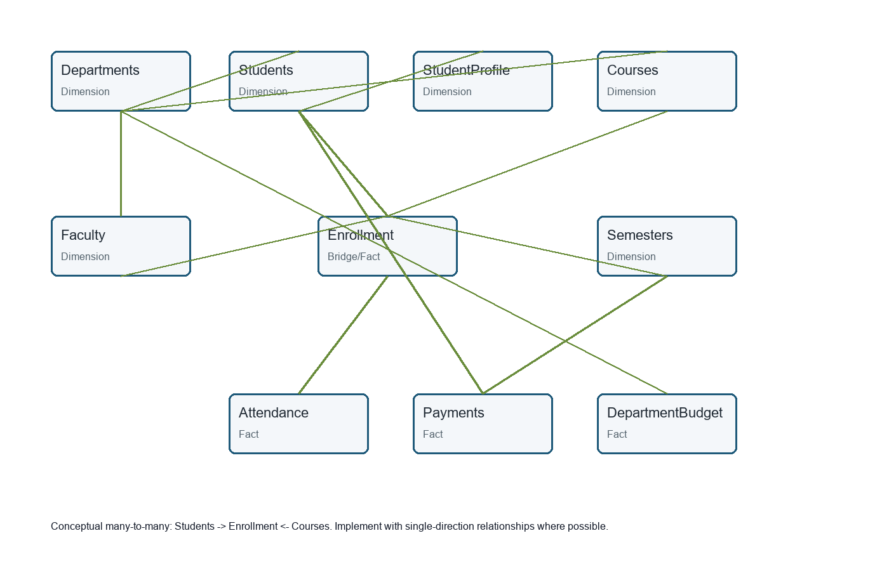

# University Academic Analytics - Power BI Assignment

  

Synthetic university analytics project for the assignment **Data Analysis and Reporting Using Power BI**.

## Published Analytics

- Public analytics viewer: [GitHub Pages dashboard](https://monokayser.github.io/University-PowerBI-Analytics/)
- Demo video: [University_Analytics_Demo.mp4](https://github.com/Monokayser/University-PowerBI-Analytics/raw/main/docs/downloads/University_Analytics_Demo.mp4)
- Release package: [v1.1.0](https://github.com/Monokayser/University-PowerBI-Analytics/releases/tag/v1.1.0)
- Published access notes: `PUBLISHED_ANALYTICS.md`

## Dataset Size

- Students: 1,000
- Departments: 10
- Courses: 70
- Faculty: 50
- Enrollment records: 12,500
- Attendance records: 22,577
- Payment records: 5,994

## Data Model



Students and Courses are conceptually many-to-many and are resolved through `Enrollment`. `Students` to `StudentProfile` is one-to-one. Department, course, faculty, semester, payment, attendance, and budget relationships are documented in `documentation/Relationship_Documentation.md`.

## Power BI Status

Power BI Desktop was not available in the build environment, so no `.pbix`, dashboard screenshot, Power BI Service URL, app URL, or public embed URL is claimed. Use `documentation/Build_PowerBI_Report_Step_by_Step.md` to create the final report from the cleaned workbook.

## Important Files

- Raw workbook: `data/raw/University_Academic_Analytics_Raw.xlsx`
- Cleaned workbook: `data/cleaned/University_Academic_Analytics_Cleaned.xlsx`
- Validation report: `data/validation/Data_Validation_Results.xlsx`
- Data dictionary: `documentation/University_Data_Dictionary.xlsx`
- DAX library: `powerbi/DAX_Measures.md`
- Date table DAX: `powerbi/Date_Table_DAX.md`
- DAX calculated columns: `powerbi/DAX_Calculated_Columns.md`
- Power Query library: `powerbi/Power_Query_M_Code.md`
- Dashboard page specifications: `documentation/Dashboard_Page_Specifications.md`
- Prompt compliance cross-check: `documentation/Prompt_Compliance_Cross_Check.md`
- Report: `report/PowerBI_Project_Report.docx` and `report/PowerBI_Project_Report.pdf`
- Presentation: `presentation/PowerBI_Project_Presentation.pptx`
- Published site source: `docs/index.html`
- Demo video: `docs/downloads/University_Analytics_Demo.mp4`

## Run

```bash
python scripts/generate_dataset.py
python scripts/clean_dataset.py
python scripts/validate_dataset.py
python scripts/exploratory_analysis.py
```

## Main Findings

- **Highest enrollment department:** English has the largest student count. Recommendation: Review section sizes and faculty allocation.
- **Highest failure course:** C018 has the highest failure rate. Recommendation: Add tutoring and review course design.
- **Attendance relationship:** Lower attendance bands show lower average final marks. Recommendation: Trigger advising below 75% attendance.
- **Outstanding payments:** Outstanding balance totals 125,733,250. Recommendation: Segment outreach by payment risk level.
- **Budget utilization:** D007 has the highest utilization in 2023. Recommendation: Review mid-year budget reallocations.
- **Scholarship distribution:** 100.0% of students receive a scholarship. Recommendation: Track outcomes by scholarship type.
- **Faculty workload:** Enrollment links faculty to taught courses for workload analysis. Recommendation: Monitor distinct courses and enrollments per faculty.
- **Graduation eligibility:** Credit and GPA measures identify students approaching eligibility. Recommendation: Add drill-through student review page.
- **Payment status:** Paid, partial, and unpaid categories provide finance risk visibility. Recommendation: Use respectful outreach workflows.
- **Semester trend:** Semester fields support enrollment and performance trend pages. Recommendation: Monitor semester-over-semester growth.

## Security

All data is fictional and synthetic. Do not commit credentials, cookies, tokens, `.env` files, Power BI session files, or authentication screenshots.
