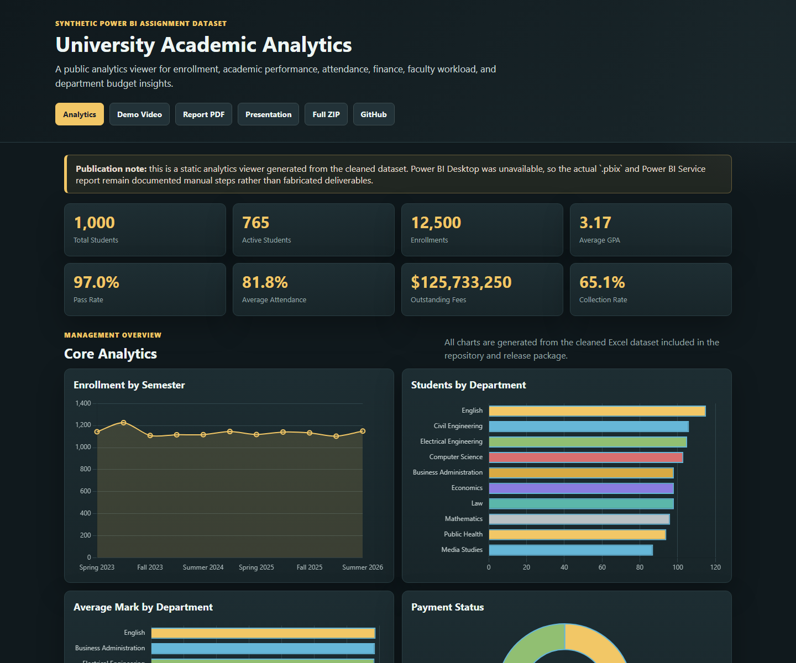
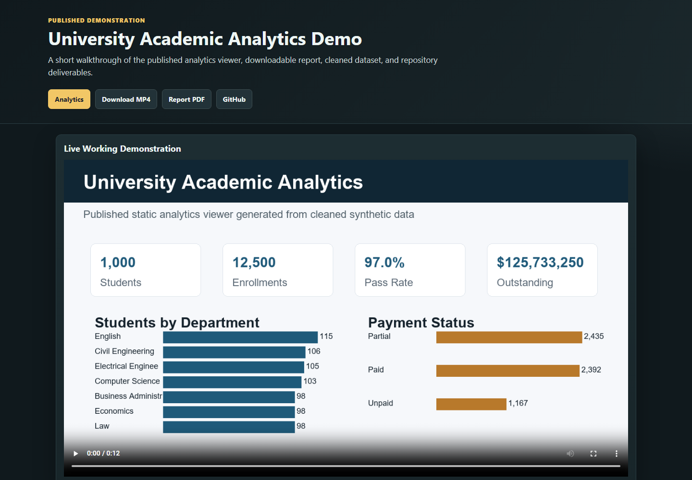

# University Academic Analytics - Power BI Project

  

Synthetic university analytics project for the **Data Visualization** course. The project provides a Power BI-ready data model, cleaned Excel dataset, DAX and Power Query documentation, academic report, presentation, public analytics viewer, screenshots, and demo video.

## Student and Course Information

| Field | Information |
|---|---|
| Student Name | S. M. Monowar Kayser |
| Student ID | 253-25-019 |
| Course Title | Data Visualization |
| Course Instructor | Sadat Hasan |
| Instructor Designation | Adjunct Faculty |
| Department | Department of Computer Science and Engineering |
| University | Daffodil International University |

## Published Links

- Live analytics viewer: [GitHub Pages dashboard](https://monokayser.github.io/University-PowerBI-Analytics/)
- Demo video page: [Published demo](https://monokayser.github.io/University-PowerBI-Analytics/demo.html)
- Repository: [University-PowerBI-Analytics](https://github.com/Monokayser/University-PowerBI-Analytics)
- Release package: [v1.1.0](https://github.com/Monokayser/University-PowerBI-Analytics/releases/tag/v1.1.0)
- Report PDF: [PowerBI_Project_Report.pdf](https://monokayser.github.io/University-PowerBI-Analytics/downloads/PowerBI_Project_Report.pdf)
- Demo MP4: [University_Analytics_Demo.mp4](https://monokayser.github.io/University-PowerBI-Analytics/downloads/University_Analytics_Demo.mp4)

## Screenshots





## Project Objectives

- Build a realistic synthetic university dataset for academic analytics.
- Clean, validate, and document the data for Power BI modeling.
- Design a star-style analytical model with fact and dimension tables.
- Provide DAX measures for enrollment, GPA, pass rate, attendance, fees, and budget analysis.
- Publish a static analytics viewer so the project can be reviewed without Power BI Desktop.
- Prepare academic documentation, screenshots, diagrams, testing evidence, and release assets.

## Dataset Summary

| Table | Rows |
|---|---:|
| Students | 1,000 |
| StudentProfile | 1,000 |
| Departments | 10 |
| Courses | 70 |
| Faculty | 50 |
| Semesters | 11 |
| Enrollment | 12,500 |
| Attendance | 22,577 |
| Payments | 5,994 |
| DepartmentBudget | 40 |

All records are fictional and generated for academic demonstration. No real student information is included.

## Main Features

- Dark/gold responsive analytics interface inspired by the supplied dashboard reference.
- KPI cards for students, active students, enrollments, GPA, pass rate, attendance, outstanding fees, and collection rate.
- Interactive Chart.js visualizations for semester enrollment, department distribution, academic marks, payment status, grade distribution, attendance, course failure rate, and outstanding fees.
- Budget utilization table and written analytical findings.
- Academic report with cover page, methodology, data cleaning, model design, DAX measures, visual interpretation, testing, findings, limitations, recommendations, references, and appendices.
- Public downloads for the report, presentation, cleaned workbook, demo video, and release ZIP.

## Project Structure

```text
data/
  raw/                         Raw generated workbook
  cleaned/                     Final cleaned workbook
  validation/                  Validation results
docs/                          GitHub Pages published site
documentation/                 Data dictionary, model notes, build guides
powerbi/                       DAX, calculated columns, Power Query notes
presentation/                  Project presentation
report/                        Final DOCX/PDF report and figures
screenshots/                   Desktop, mobile, dashboard, and demo evidence
scripts/                       Dataset, cleaning, validation, and analysis scripts
```

## Run Locally

```bash
pip install -r scripts/requirements.txt
python scripts/generate_dataset.py
python scripts/clean_dataset.py
python scripts/validate_dataset.py
python scripts/exploratory_analysis.py
python -m http.server 8000 --directory docs
```

Then open `http://localhost:8000/`.

## Power BI Status

Power BI Desktop was not available in the build environment, so this repository does not claim a fabricated `.pbix`, Power BI Service URL, app URL, or public embed URL. The included cleaned workbook, relationship documentation, DAX library, Power Query notes, and page specifications are ready for manual Power BI Desktop authoring.

## Testing and Validation

- Dataset validation: passed using `python scripts/validate_dataset.py`.
- Desktop UI: checked with a local Chrome capture at `1440x1200`.
- Mobile UI: checked with a local Chrome capture at `390x1400`.
- Published assets: report, presentation, workbook, screenshots, demo video, and ZIP are included under `docs/downloads/`.
- Chart resilience: KPIs, tables, and findings still render if the external Chart.js CDN is delayed; chart panels show a clear fallback message.

## Key Findings

- English has the largest student count among departments.
- Course `C018` has the highest failure rate and should be prioritized for academic support.
- Lower attendance bands are associated with lower average final marks.
- Outstanding fees total `$125,733,250`, requiring department-level follow-up.
- Scholarship coverage is `32.0%`, after preserving the `None` scholarship category correctly.
- Budget utilization differs by department and should be reviewed during mid-year planning.

## Important Files

- Cleaned workbook: `data/cleaned/University_Academic_Analytics_Cleaned.xlsx`
- Validation report: `data/validation/Data_Validation_Results.xlsx`
- Data dictionary: `documentation/University_Data_Dictionary.xlsx`
- DAX measures: `powerbi/DAX_Measures.md`
- Power Query notes: `powerbi/Power_Query_M_Code.md`
- Report: `report/PowerBI_Project_Report.docx` and `report/PowerBI_Project_Report.pdf`
- Presentation: `presentation/PowerBI_Project_Presentation.pptx`
- Published site source: `docs/index.html`
- Demo video: `docs/downloads/University_Analytics_Demo.mp4`

## Security and Academic Integrity

The project uses synthetic data only. Do not commit credentials, cookies, tokens, `.env` files, Power BI session files, or authentication screenshots. External libraries and tools are acknowledged in the report and documentation.
